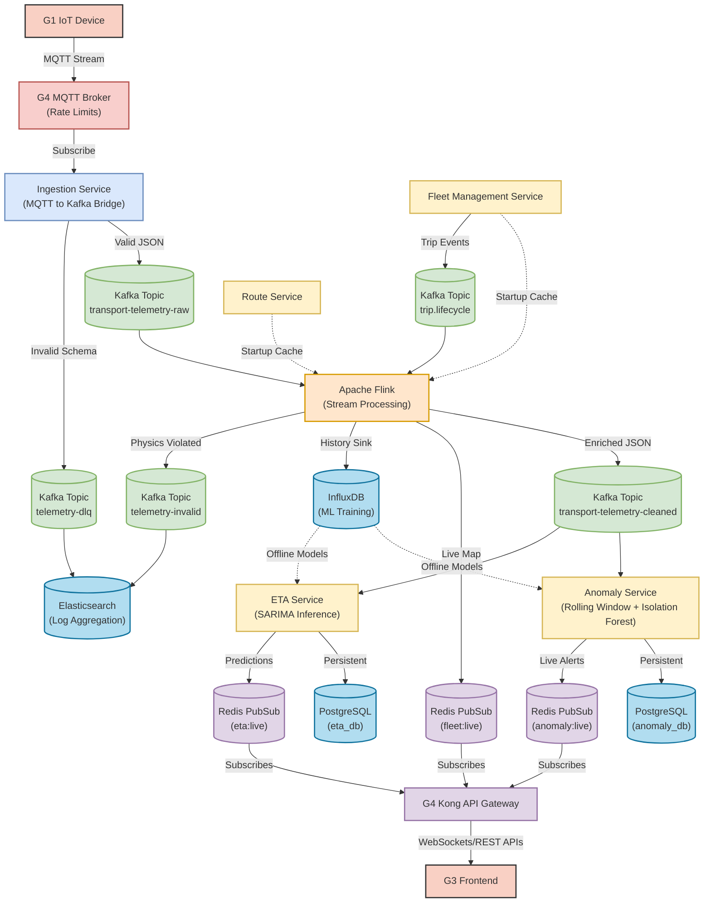

# OnTime G2: Event-Driven Telemetry Pipeline

Welcome to the **OnTime G2** repository. OnTime G2 is an enterprise-scale, event-driven telemetry and public transport tracking system. It processes millions of GPS data points, detects spatial anomalies, and calculates real-time ETAs using an advanced ML/Physics cascade.

## 🚀 System Architecture

OnTime G2 shifts away from traditional CRUD-based synchronous updates to a highly scalable, distributed **"Source of Truth"** pipeline powered by Apache Flink and Kafka. The system is divided into three distinct layers:

1. **Ingestion Layer (Stateless)**
2. **The Physics & Reality Engine (Stateful Stream Processing)**
3. **The Behavioral Layer (ML & Rules-based Analytics)**

### Microservices Topology



## 🏗️ Core Microservices

The repository is structured into distinct microservices, each with a very specific bounded context:

- **[Ingestion Service](services/ingestion/)**: The high-throughput edge bridge that securely validates incoming MQTT payloads and drops them into Kafka.
- **[Stream Processing (Flink)](services/stream-processing/)**: The physics engine. It joins live GPS pings with static route geometries to calculate exactly where a bus is on its route. It **classifies** bad behavior (like going off-route) rather than dropping it.
- **[ETA Service](services/eta-service/)**: Consumes cleaned streams, applies time-series smoothing, and uses an intelligent `XGBoost -> SARIMA -> Physics` cascade to predict arrival times.
- **[Anomaly Service](services/anomaly-service/)**: Uses Isolation Forests and DBSCAN spatial clustering to detect erratic driving, unauthorized stationary behavior, and route deviations.
- **[Websocket Service](services/websocket-service/)**: Provides high-frequency, low-latency live map updates and secure alert delivery to frontend dashboards.
- **[Fleet & Route Services](services/fleet-management-service/)**: Standard CRUD microservices managing static transportation data.

## 📚 Documentation & Plans

Detailed architectural decisions, increment plans, and change requests are documented in the `docs/` directory:

- [**Change Requests**](docs/change_requests/): Contains CR1 (Event-Driven Architecture) and CR2 (Model Fortification).
- [**Component Designs**](docs/components/): Detailed designs for ETA cascades, Anomaly pipelines, and G1 remote configuration.
- [**Increments**](docs/increments/): Delivery roadmaps and increment breakdowns.
- [**Kong Integration**](docs/kong/): API Gateway and Keycloak authentication setups.
- [**Project Strategy**](docs/project/): Overall vision and strategic direction.

## ⚙️ Quick Start (Docker Compose)

The entire OnTime G2 platform can be spun up locally for development using Docker Compose.

```bash
# 1. Start the core infrastructure (Kafka, Redis, Postgres, MQTT)
cd docker
docker-compose -f docker-compose.infra.yml up -d

# 2. Start the microservices
docker-compose -f docker-compose.yml up --build -d
```
