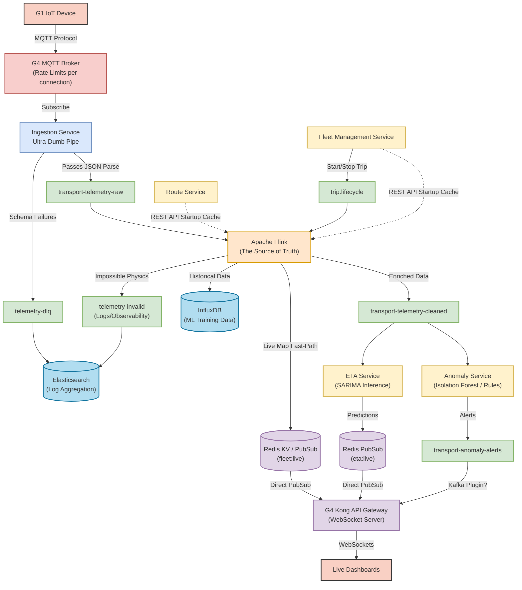

# Architecture Change Request (CR 1): The Event-Driven Source of Truth

**Date:** 2026-05-06
**Status:** On Hold
**Scope:** Re-architecting the telemetry pipeline to define strict boundaries between structural validation, physical integrity, and behavioral ML analysis.

## 1. The Core Philosophy

This architecture shifts away from a "smart ingestion" model to a highly scalable, distributed **"Source of Truth"** pipeline powered by Apache Flink. We divide our data processing into three distinct layers:
1. **The Dumb Pipe:** Ingestion Service (Stateless)
2. **The Physics & Reality Engine:** Stream Processing / Flink (Stateful)
3. **The Behavioral Layer:** ETA & Anomaly Services (ML / Rules)

---

## 2. Telemetry Pipeline Architecture

---

## 3. The "Classify, Don't Drop" Rule

A fundamental shift in this architecture is how we handle "bad" behavior. 

**Rule:** If a GPS ping disobeys the laws of physics (e.g. going 200km/h or teleporting), Flink drops it into `telemetry-invalid` for observability. **However**, if a ping obeys physics but behaves badly (e.g., bus is off route, or moving while the trip is marked INACTIVE), Flink **classifies it** and passes it on.

### The Flow:
1. **Flink's Job:** Map matches the GPS. Finds the bus is off-route. It appends `on_route = false` to the JSON payload and pushes it to `transport-telemetry-cleaned`.
2. **ETA Service's Job:** Sees `on_route = false` and safely ignores the event (it cannot calculate an ETA).
3. **Anomaly Service's Job:** Sees `on_route = false` and immediately fires a "Route Deviation Anomaly" alert to the WebSockets.

This prevents silent data loss and ensures our ML and anomaly models have full visibility into unauthorized bus movements.

---

## 4. Why Apache Flink & How it gets Data

To avoid overloading the Postgres databases with thousands of queries per second, we are relying heavily on Flink. 

**Microservice Independence (No direct DB coupling):**
You correctly pointed out that Flink should NOT directly read the Fleet/Route Postgres databases. That breaks microservice rules! Instead:
1. **Startup Cache via REST:** When Flink boots up, it makes a one-time `GET` request to the Route Service and Fleet Service REST APIs to download the route geometries and active trips. It stores these in its highly-optimized internal **RocksDB memory**.
2. **Event-Driven Updates via Kafka (`trip.lifecycle`):** When a driver starts or ends a trip, the Fleet Service publishes an event to the `trip.lifecycle` Kafka topic. Flink consumes this topic in real-time to update its internal RocksDB cache without ever hitting the REST API again.

This ensures Flink calculates geo-math in microseconds while strictly respecting microservice boundaries.

---

## 5. Storage and Observability Matrix

| Component | Technology | Purpose in System |
| :--- | :--- | :--- |
| **Relational Ground Truth** | `PostgreSQL` | Defines active buses, trips, ETA configurations, and user metadata. |
| **Spatial Ground Truth** | `PostGIS` | Holds route polylines and stop coordinates. |
| **Live State / WebSockets** | `Redis` | Powers zero-latency map updates (`fleet:live`). If G2 API Gateway is bypassed, **Kong directly subscribes to Redis** via Lua plugins to push WS frames to clients. |
| **Offline ML Training** | `InfluxDB` | Sinks all valid telemetry for data scientists to train SARIMA and Isolation Forest models. |
| **Observability / Logs** | `Elasticsearch` / `Postgres JSONB` | Sinks the DLQ and Invalid topics so engineers can debug G1 firmware errors. |

---

## 6. Microservice Independence

This architecture adds **no new microservices** beyond the previously defined Increment plan. Instead, it rebalances the workload:
- `Ingestion` becomes purely stateless (easy to scale).
- `Flink` becomes the heavy-lifting state engine.
- `ETA` and `Anomaly` become isolated, specialized analytic consumers. 

*(End of CR 1 Document)*
