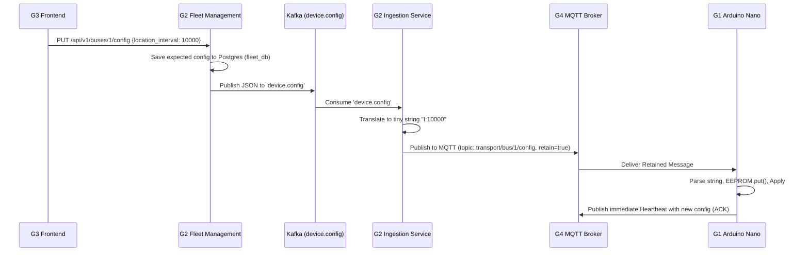

# Remote Device Configuration (G1 -> G4) Architecture Plan

This document details the bidirectional configuration pipeline bridging the G3 Frontend, G2 Backend, and G1 Hardware using an MQTT-Kafka bridge pattern.

## Architecture Flow

The core architecture utilizes the **Ingestion Service** as a bidirectional bridge. 

1. **Inbound (Telemetry):** MQTT -> Ingestion Service -> Kafka `transport-telemetry-raw`
2. **Outbound (Config):** Kafka `device.config` -> Ingestion Service -> MQTT `transport/bus/{id}/config`

This ensures that the Fleet Management Service remains completely decoupled from MQTT and IoT hardware details.

## Component Responsibilities

### 1. G1 Hardware (Arduino Nano)
- **EEPROM Storage:** Includes `<EEPROM.h>` to save configurable parameters (e.g., `LOCATION_INTERVAL_MS`) so they persist across hardware reboots.
- **MQTT Subscription:** Subscribes to `transport/bus/{busId}/config`.
- **Parsing:** Implements `mqttCallback` to parse tiny memory-efficient strings (e.g., `I:10000`).
- **Instant ACK:** Immediately forces a `publishHeartbeatIfDue(true)` containing `"current_interval": 10000` to acknowledge receipt of the config to the backend.

### 2. G2 Fleet Management Service
- **API Endpoint:** Exposes `PUT /api/v1/fleet/buses/{bus_id}/config` for the Admin dashboard.
- **Kafka Producer:** Publishes the validated JSON payload into the `device.config` Kafka topic.

### 3. G2 Ingestion Service (The Bridge)
- **Kafka Consumer:** Runs `DeviceConfigConsumer` in a background thread listening to `device.config`.
- **Translation Layer:** Translates the heavy JSON payload into the tiny string format required by the Arduino's limited SRAM.
- **MQTT Publisher:** Uses `paho-mqtt` to publish the configuration string.
- **Retained Messages:** Sets `retain=true` on the MQTT publish. This is crucial because the Arduino's `SoftwareSerial` toggling means it may be deaf to the GSM network while reading GPS data. A retained message guarantees delivery the millisecond the Arduino reconnects to the broker.

### 4. G3 Frontend
- Provides the Admin UI sliders/inputs to adjust intervals.
- Relies on the standard Heartbeat WebSocket feed to visually confirm (via a green checkmark) when the Arduino successfully applies the configuration (the ACK).
