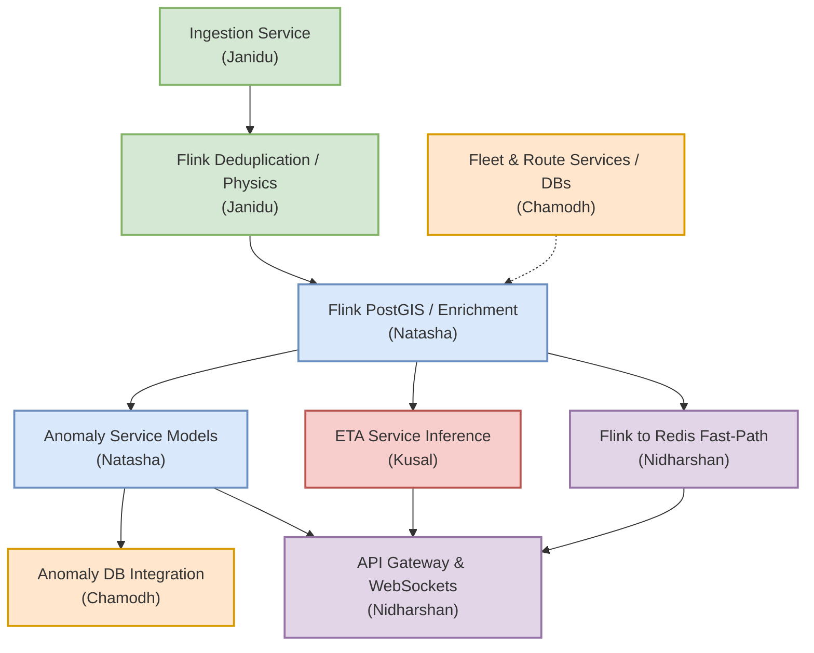

# OnTime G2 - Increment 2 Execution Plan

**Date:** 2026-05-06
**Status:** Active Execution Phase
**Objective:** Implement the "Source of Truth" streaming architecture defined in `CR_1.md` and deliver the final ML/Predictive models (SARIMA and Isolation Forest) to complete the project.

## 1. Industry Best Practices & Conventions

Before diving into individual responsibilities, the team MUST adhere to the following standards across ALL microservices. This ensures a professional, scalable, and maintainable codebase.

1. **Consistent Folder Structure**: Every Python service must look exactly like this:
   ```text
   services/<service-name>/
   ├── app/
   │   ├── __init__.py
   │   ├── main.py              # Entrypoint
   │   ├── config.py            # Environment variable loading
   │   ├── models/              # Pydantic & ORM schemas
   │   ├── routers/             # API Endpoints
   │   └── services/            # Business logic
   ├── tests/                   # Unit & Integration Tests
   ├── Dockerfile
   ├── requirements.txt
   └── README.md
   ```
2. **Environment Variables**: NO hardcoded values. Everything (Ports, Kafka Brokers, DB URLs, API keys) must be loaded dynamically at runtime via `app/config.py` using `pydantic-settings`.
3. **Shared Contracts**: Use a centralized `schemas/` directory at the repository root for shared Pydantic data contracts (like `GPSMessage`) to prevent duplicate code.
4. **Consistent READMEs**: Every service must have a standard README detailing: (1) Purpose, (2) Setup instructions, (3) Environment variables needed, and (4) Exposed Ports/Topics.

---

## 2. Data Contracts & Schema Freeze

To prevent any integration mismatches between team members, the following Kafka topics and JSON schemas are strictly frozen. All Pydantic models must match these exactly.

### Topic 1: `transport-telemetry-raw` (From Ingestion to Flink)
The raw output from the MQTT devices after passing schema validation.
```json
{
  "bus_id": "BUS-123",
  "trip_id": "TRIP-456",
  "lat": 6.9271,
  "lon": 79.8612,
  "speed": 45.2,
  "heading": 90.0,
  "timestamp": "2026-05-06T10:00:00Z"
}
```

### Topic 2: `trip.lifecycle` (From Fleet Service to Flink)
Published whenever a driver starts or ends a trip.
```json
{
  "bus_id": "BUS-123",
  "trip_id": "TRIP-456",
  "route_id": "R-100",
  "status": "ACTIVE",      // or "INACTIVE"
  "timestamp": "2026-05-06T10:00:00Z"
}
```

### Topic 3: `transport-telemetry-cleaned` (From Flink to ETA/Anomaly)
**Crucial Enrichment Contract**: Flink adds four new fields based on its stateful map-matching.
```json
{
  "bus_id": "BUS-123",
  "trip_id": "TRIP-456",
  "lat": 6.9271,
  "lon": 79.8612,
  "speed": 45.2,
  "heading": 90.0,
  "timestamp": "2026-05-06T10:00:05Z",
  // --- FLINK ENRICHED FIELDS BELOW ---
  "route_id": "R-100",           // Fetched from Fleet active trip cache
  "trip_status": "ACTIVE",       // Appended from trip.lifecycle state
  "on_route": true,              // Map-matching Boolean
  "remaining_distance_m": 1250.5 // Computed from PostGIS polyline
}
```

### Topic 4: `transport-anomaly-alerts` (From Anomaly Service to Gateway)
Triggered by rules or Isolation Forest ML.
```json
{
  "bus_id": "BUS-123",
  "timestamp": "2026-05-06T10:00:05Z",
  "anomaly_type": "ROUTE_DEVIATION",  // or "UNAUTHORIZED_MOVEMENT", "ERRATIC_DRIVING"
  "severity": "HIGH",
  "description": "Bus is 200m off route R-100"
}
```

### Topic 5: `eta:live` (Redis PubSub - From ETA to WebSockets)
```json
{
  "bus_id": "BUS-123",
  "route_id": "R-100",
  "timestamp": "2026-05-06T10:00:05Z",
  "eta_seconds": 120,
  "model_version": "sarima-v1.0"
}
```

---

## 3. System Responsibilities Matrix



---

## 3. Detailed Member Sub-Phases

To ensure zero overlap and 100% project completion (including all tests and ML models), follow these strict sub-phases.

### 3.1 Janidu — Ingestion & Flink Core
**Goal:** Build the ultra-fast stateless ingestion pipe and the Flink physical reality engine.

- **Phase J1 — Ingestion Strip-down:**
  - Delete `validator.py` stateful logic (hashes, timestamps).
  - Implement pure JSON schema parsing (Pydantic) and data-type checking.
  - Implement Prometheus `/metrics` (messages received, parse failures).
  - Write unit tests ensuring bad JSON goes to `telemetry-dlq` and good JSON goes to `transport-telemetry-raw`.
- **Phase J2 — Flink Infrastructure:**
  - Create the `services/stream-processing` directory.
  - Set up PyFlink Docker images (JobManager + TaskManager) in `docker-compose.yml`.
  - Write Kafka Source and Sink connectors in PyFlink to consume `transport-telemetry-raw`.
- **Phase J3 — Flink Physical Validation (The Reality Engine):**
  - Implement Event-Time Watermarking using the JSON timestamp.
  - Implement deduplication logic.
  - Implement the Physical Rules: drop speeds > 200km/h, drop geo-locations outside the Sri Lanka bounding box.
  - Sink these dropped messages to the `telemetry-invalid` Kafka topic.
- **Phase J4 — E2E Testing:**
  - Write integration tests pumping dummy MQTT data and verifying it correctly drops physics violations and emits valid data to Flink.

### 3.2 Kusal — ETA Service & Predictive Modeling
**Goal:** Deliver the final SARIMA-based real-time ETA model.

- **Phase K1 — ETA Service Architecture:**
  - Build `services/eta-service/` using FastAPI.
  - Implement a Kafka consumer (running via `asyncio` background task) to consume `transport-telemetry-cleaned`.
  - Ensure the service immediately ignores events where `on_route == false` or `trip_status == INACTIVE`.
- **Phase K2 — SARIMA Model Development:**
  - Use Python (`statsmodels` or `pmdarima`) to train a SARIMA model offline using historical data from InfluxDB.
  - Model objective: Predict travel time based on rolling averages of speed/congestion.
  - Save the trained model artifact (e.g., `.pkl` or ONNX format).
- **Phase K3 — Real-Time Inference:**
  - Load the SARIMA model into the ETA service at startup.
  - Feed the single enriched ping into the model.
  - Format the prediction and publish it to the Redis PubSub channel `eta:live`.
  - Save the prediction to Postgres (`eta_db`) for historical analytics.
- **Phase K4 — Testing & Metrics:**
  - Expose Prometheus `/metrics` (predictions made, model latency).
  - Write unit tests simulating edge cases (e.g., bus stopped at a light vs traffic jam) to ensure the SARIMA model responds correctly.

### 3.3 Natasha — Flink Enrichment & Anomaly Service
**Goal:** Provide context to the raw data and deploy the Isolation Forest behavioral model.

- **Phase N1 — Flink State Enrichment:**
  - Inside the Flink job, add logic to make a one-time REST API call to Route and Fleet services at startup to fetch PostGIS geometries and active trips.
  - Implement a Kafka Consumer for the `trip.lifecycle` topic to keep the active trip cache updated in real-time.
  - Map-match incoming valid pings to the route. Calculate `remainingDistance`.
  - Implement the "Classify, Don't Drop" rule: append `on_route` (boolean) and `trip_status` (string).
  - Sink this enriched JSON to `transport-telemetry-cleaned`.
  - **Crucial:** Create an InfluxDB Sink in Flink to dump all valid pings into InfluxDB for offline ML training.
- **Phase N2 — Anomaly Service Architecture:**
  - Build `services/anomaly-service/` using FastAPI.
  - Create a Kafka consumer for `transport-telemetry-cleaned`.
  - Implement rule-based checks: Trigger instant alerts if `trip_status == INACTIVE` but speed > 0, or if `on_route == false`.
- **Phase N3 — Isolation Forest ML Model:**
  - Train an **Isolation Forest** offline using `scikit-learn` on InfluxDB data to detect erratic driving patterns (e.g., unusual acceleration/deceleration sequences on a valid route).
  - Maintain a sliding window of the last 10 pings per bus in the Anomaly Service memory.
  - Feed the sliding window into the Isolation Forest model. If anomalous, publish to `transport-anomaly-alerts` (Kafka).
- **Phase N4 — Testing & Tuning:**
  - Tune the Isolation Forest contamination parameter to avoid false positives.
  - Write unit tests proving off-route events trigger rules, and erratic speeds trigger the ML model.

### 3.4 Chamodh — Databases & Fleet/Route Stability
**Goal:** Ensure ground-truth databases are highly optimized and create the persistent anomaly storage.

- **Phase C1 — Database Optimization:**
  - Ensure `route_db` (PostGIS) and `fleet_db` (Postgres) are fully structured via migration scripts or `docker-compose` init scripts.
  - Add Spatial Indexes (GiST) to PostGIS geometries so Flink can query them instantly on startup.
- **Phase C2 — Fleet & Route Service Finalization:**
  - Ensure `/health` endpoints meet the team standard.
  - Ensure the internal REST APIs exposing Routes and Active Trips are stable so Flink can safely query them at startup.
  - Add logic in the Fleet Management Service to publish a message to the `trip.lifecycle` Kafka topic whenever a driver starts or stops a trip.
- **Phase C3 — Anomaly DB Integration:**
  - Create the `anomaly_db` schema in Postgres.
  - Create REST endpoints in the Anomaly Service (or Gateway) to fetch historical alerts (e.g., `GET /api/v1/anomalies/bus/123`).
  - Wire the Anomaly Service to save every alert into this database for auditing.
- **Phase C4 — Observability DBs:**
  - Configure the Log sink (Telegraf or simple Python script) to dump `telemetry-dlq` and `telemetry-invalid` into an Elasticsearch container (or Postgres JSONB table) for debugging.

### 3.5 Nidharshan — Flink-to-Redis, WebSockets & API Gateway
**Goal:** Build the zero-latency delivery mechanism for the passenger and admin dashboards.

- **Phase Nd1 — Flink-to-Redis Bypass:**
  - Work inside PyFlink to create a Redis Sink.
  - For every cleaned ping, overwrite the Redis Key `bus:{busId}:position` (so we always have the latest state).
  - Simultaneously publish the payload to the Redis PubSub channel `fleet:live`.
- **Phase Nd2 — WebSocket Kong Configuration (G2 Gateway Bypass):**
  - If Chamodh confirmed the G2 API Gateway is bypassed for live feeds, work with G4 to configure the **Kong API Gateway** to act as the WebSocket server.
  - Write the necessary Kong Lua plugins (or use existing Redis plugins) so Kong directly subscribes to Redis PubSub (`fleet:live`, `eta:live`) and pushes to connected WebSockets.
  - *Note:* If Kong cannot natively subscribe to Redis PubSub, fallback to building the WebSocket endpoint in the G2 API Gateway.
- **Phase Nd3 — REST API Aggregation:**
  - Build standard GET endpoints in the API Gateway to proxy requests to Kusal's ETA service (for initial ETA load) and Chamodh's Fleet service (for bus lists).
  - Implement CORS and ensure headers passed from G4 Kong are handled securely.
- **Phase Nd4 — Load Testing:**
  - Write a script to simulate 500+ WebSocket clients connecting to the API Gateway simultaneously. Ensure the Gateway does not crash and Redis handles the PubSub fan-out seamlessly.

---

## 4. Final Delivery Checklist

To officially "finish off our thing" and deliver the complete Increment:
- [ ] All 5 microservices follow the identical `app/` folder structure.
- [ ] NO hardcoded variables; `config.py` used exclusively.
- [ ] SARIMA model successfully predicting ETAs in real-time.
- [ ] Isolation Forest model successfully catching erratic behavioral anomalies.
- [ ] Flink correctly executing the "Classify, Don't Drop" logic (Source of Truth).
- [ ] API Gateway smoothly streaming 3 separate PubSub channels over one WebSocket connection.
- [ ] 100% pass rate on Integration and Unit tests across all services.
