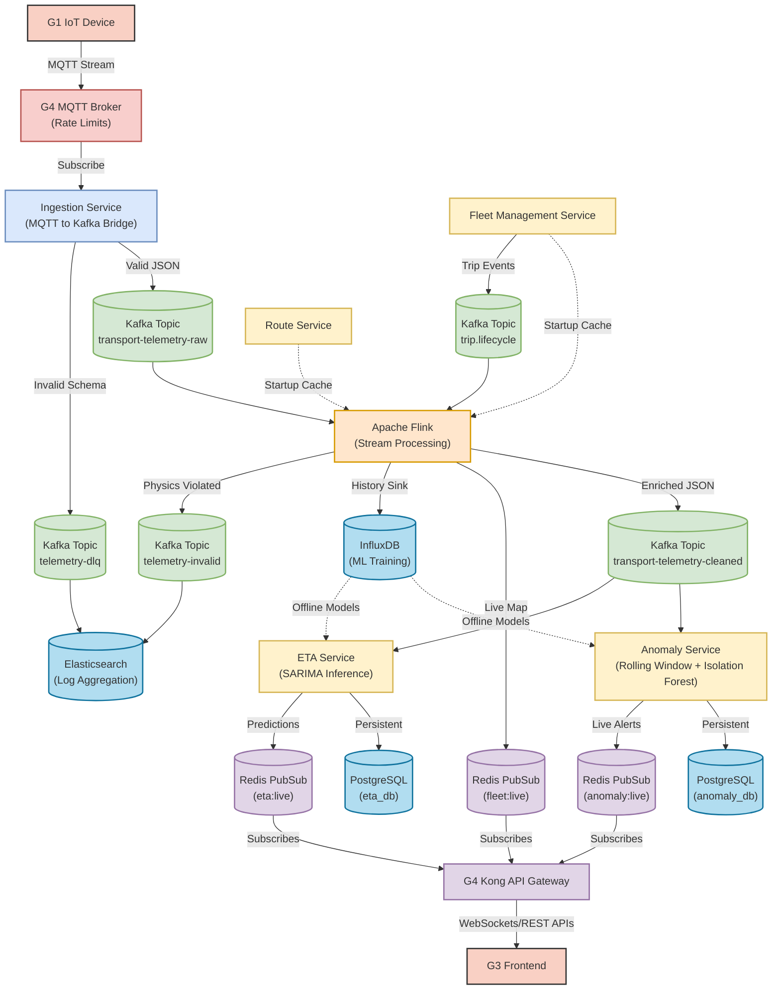

# Data Streaming Pipeline Diagram

This diagram isolates the high-speed, real-time data flow of the telemetry pipeline. It deliberately omits standard CRUD REST APIs to focus purely on how thousands of GPS pings per second are processed through Kafka, Flink, and delivered out to WebSockets.

