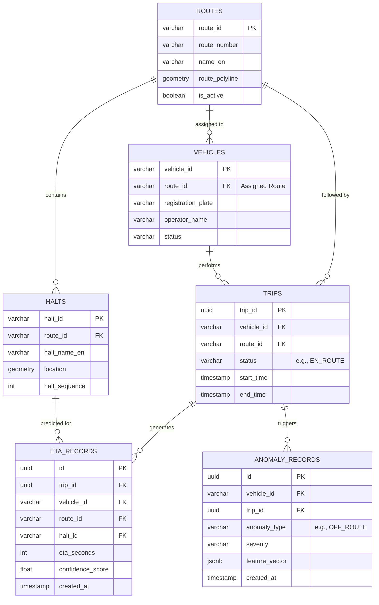

# Entity-Relationship Diagram (ERD)

This diagram illustrates the logical database schema across the isolated G2 microservice databases. 
Note: While these tables physically reside in separate logical databases (`route_db`, `fleet_db`, `eta_db`, `anomaly_db`) to enforce microservice boundaries, they relate to each other logically via foreign keys like `route_id` and `vehicle_id`.

