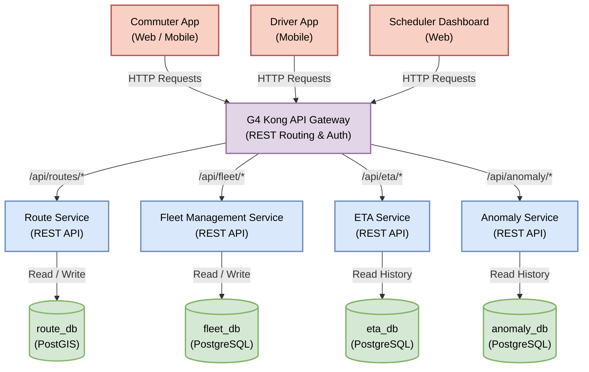

# Microservices Topology Diagram

This diagram maps out the REST API routing, microservices, and databases for the G2 backend.

```mermaid
graph TD
    classDef client fill:#f9d0c4,stroke:#b85450,stroke-width:2px,color:#000;
    classDef gateway fill:#e1d5e7,stroke:#9673a6,stroke-width:2px,color:#000;
    classDef service fill:#dae8fc,stroke:#6c8ebf,stroke-width:2px,color:#000;
    classDef db fill:#d5e8d4,stroke:#82b366,stroke-width:2px,color:#000;

    %% Clients
    CommuterApp["Commuter App<br>(Web / Mobile)"]:::client
    DriverApp["Driver App<br>(Mobile)"]:::client
    SchedulerDash["Scheduler Dashboard<br>(Web)"]:::client

    %% Gateway
    Kong["G4 Kong API Gateway<br>(REST Routing & Auth)"]:::gateway

    %% Microservices
    RouteService["Route Service<br>(REST API)"]:::service
    FleetService["Fleet Management Service<br>(REST API)"]:::service
    ETAService["ETA Service<br>(REST API)"]:::service
    AnomalyService["Anomaly Service<br>(REST API)"]:::service

    %% Databases
    RouteDB[("route_db<br>(PostGIS)")]:::db
    FleetDB[("fleet_db<br>(PostgreSQL)")]:::db
    ETADB[("eta_db<br>(PostgreSQL)")]:::db
    AnomalyDB[("anomaly_db<br>(PostgreSQL)")]:::db

    %% Client to Gateway
    CommuterApp -->|HTTP Requests| Kong
    DriverApp -->|HTTP Requests| Kong
    SchedulerDash -->|HTTP Requests| Kong

    %% Gateway to Services
    Kong -->|/api/routes/*| RouteService
    Kong -->|/api/fleet/*| FleetService
    Kong -->|/api/eta/*| ETAService
    Kong -->|/api/anomaly/*| AnomalyService

    %% Services to DBs
    RouteService -->|Read / Write| RouteDB
    FleetService -->|Read / Write| FleetDB
    ETAService -->|Read History| ETADB
    AnomalyService -->|Read History| AnomalyDB
```
