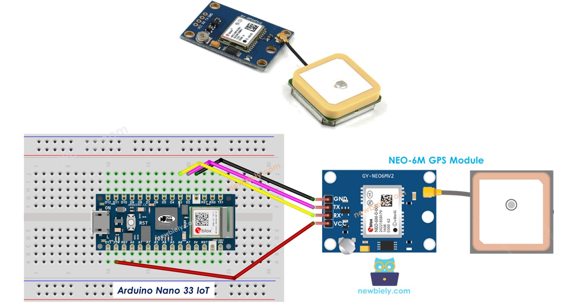
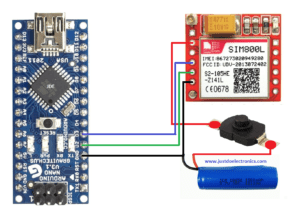

# OnTime G1 IoT Project

Welcome to the **OnTime G1** repository! This repository contains the firmwares and testing scripts for our IoT system utilizing an **Arduino Nano**, **NEO-6M GPS**, **SIM800L GSM module**, and **HiveMQ MQTT Broker**.

To make it easier for our team and standard users to replicate and push the code, this guide provides a step-by-step process with diagrams.

---

## OnTime G2 MQTT Contract

The reference sketches in this folder are aligned with the G2 ingestion plan.

G1 publishes GPS location only. It does **not** publish `tripId`. G2 Ingestion
resolves the active trip by checking `busId` against Fleet's Kafka
`trip.lifecycle` cache.

Location topic:

```text
transport/bus/{busId}/location
```

Location payload:

```json
{
  "busId": "1",
  "lat": 6.9271,
  "lon": 79.8612,
  "speed": 35.0,
  "heading": 120.0,
  "timestamp": "2026-05-02T10:15:30Z"
}
```

Heartbeat topic:

```text
transport/bus/{busId}/heartbeat
```

Heartbeat payload:

```json
{
  "busId": "1",
  "deviceId": "GPS-1",
  "timestamp": "2026-05-02T10:15:30Z",
  "gpsFix": true,
  "satellites": 8,
  "signalQuality": 21,
  "firmwareVersion": "g1-0.1.0"
}
```

Important rules:

- `timestamp` is mandatory and must come from GPS event time.
- `busId` is the Fleet bus `id`, serialized as a string.
- Live GPS publishes must use retained=false.
- Heartbeat publishes may use retained=true because they represent latest device
  status, not live movement.
- Field names must be `busId`, `lat`, `lon`, `speed`, `heading`, and
  `timestamp`.
- `tripId` is intentionally not included in the GPS payload.
- HiveMQ Cloud usually requires TLS on port 8883. The current SIM800L sketches
  use non-TLS `TinyGsmClient`, so TLS support must be confirmed before using
  HiveMQ Cloud directly.

---

## 🛠️ Hardware Requirements
- **Microcontroller**: Arduino Nano
- **GPS Module**: NEO-6M (or similar GPS Neo module)
- **GSM Module**: SIM800L (Needs stable 3.7V - 4.2V 2A power supply)
- **MQTT Broker**: HiveMQ (Cloud or Local)
- **Miscellaneous**: Jumper wires, Breadboard, Logic Level Converters (if strictly required for RX/TX 5V/3.3V).

---

## 🚀 Step 1: GPS Setup & Test

The first step is to verify that the NEO-6M GPS module is receiving coordinates. Place the module near a window or outdoors to get a satellite fix (the LED on the GPS will start blinking).

### Wiring Diagram (GPS -> Arduino Nano)



### Instructions:
1. Connect the hardware as shown in the diagram above.
2. Open the `Component Check/GPS_Check` sketch and load it onto your Arduino.
3. Open the Serial Monitor at **9600 baud**.
4. **Expected Output**: You should see latitude and longitude printed on the screen once a satellite fix is achieved.

*(If your GPS module requires a firmware reset/update to change baud rates or frequencies, refer to `Firmware Updates/GPS_Firmware_Update`).*

---

## 🚀 Step 2: GSM Network Check

Before sending data to the cloud, verify that the SIM800L module registers to the cellular network. The SIM800L requires a strong power supply (up to 2A peaks). **Do not power it directly from the Arduino Nano's 5V pin** or it will reboot under load.

### Wiring Diagram (GSM -> Arduino Nano)



### Instructions:
1. Ensure your SIM card has an active data plan and no PIN lock. 
2. Wire the SIM800L according to the diagram above. Ensure the grounds are shared!
3. Open the `Component Check/GSM_Check` sketch and flash the code.
4. Open the Serial Monitor.
5. **Expected Output**: Sending `AT` should return `OK`. Checking `AT+CPIN?` should say `READY`, and `AT+CREG?` should show `0,1` or `0,5` (registered to network).

---

## 🚀 Step 3: GSM + MQTT Connection (Dummy Data)

Once the network connection is verified, we can test the MQTT link to **HiveMQ**.

### Instructions:
1. Make sure your HiveMQ cluster is configured. Note your **Broker URL**, **Port** (usually `1883` or `8883`), **Username**, and **Password**.
2. Open the `Testing_Dummy_Data/GSM+MQTT+Dummy` sketch.
3. Edit the code to include your APN (e.g., `internet`), HiveMQ broker credentials, and topic.
4. Flash the code to the Arduino.
5. Use an MQTT client (like MQTTX or HiveMQ Web Client) to subscribe to your topic.
6. **Expected Output**: You should see dummy JSON or text data arriving at your HiveMQ topic every few seconds.

---

## 🚀 Step 4: The Core System (GSM + GPS + MQTT)

Now we connect everything together. The Arduino will read coordinates from the GPS and publish them to HiveMQ via the SIM800L.

### Complete System Wiring


*Note: If possible, use Hardware Serial for one of the modules (like the GSM) if running out of SoftSerial resources, or use `SoftwareSerial::listen()` intelligently, as the Arduino Nano (ATmega328P) cannot listen to two SoftwareSerial ports simultaneously.*

### Instructions:
1. Assemble all connections on the breadboard or PCB prototype.
2. Open `Full_Implementation/GSM+GPS+MQTT` and update the sketch with your specific APN and HiveMQ Broker details.
3. Upload the sketch.
4. **Expected Output**: The Arduino will print `"GPS Fix acquired..."` and successfully publish genuine coordinates to the HiveMQ topic. 

### Contributing
Before pushing your IoT team codes to the G1 repo on top of these templates:
1. Ensure they remain cleanly separated into their respective structural folders (e.g., `Component Check`, `Full_Implementation`).
2. Add any updated sketches directly in those folders.
3. Don't commit sensitive credentials (like your actual HiveMQ production password). Use placeholder variables or header files omitted by `.gitignore`.
